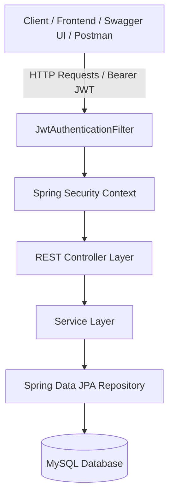

# Campus Complaint Tracker API

A production-ready Spring Boot 3.5.x RESTful Web Application for tracking campus infrastructure complaints, equipped with JWT authentication, RBAC, JPA Specifications, and Excel/CSV export capabilities.

## Architecture



## Features

- **Authentication & Security**: Registration, login, password encryption via BCrypt, JWT stateless authorization.
- **Role-Based Access Control**:
  - `USER`: Register, log in, create complaints, update/delete own complaints.
  - `ADMIN`: Manage all complaints, assign tasks, update status with remarks, view dashboard stats, export reports.
- **Dynamic Search & Filtering**: JPA Specifications filtering by category, priority, building, status, keyword search, date range.
- **Reporting & Export**: Export complaints report to CSV and Excel (`.xlsx`).
- **Swagger Documentation**: Interactive OpenAPI 3 UI available out-of-the-box.

## Tech Stack

- **Java**: 17
- **Framework**: Spring Boot 3.5.x
- **Database**: MySQL 8.x
- **ORM**: Spring Data JPA (Hibernate)
- **Security**: Spring Security + JJWT 0.12.6
- **Documentation**: SpringDoc OpenAPI (Swagger 3)
- **Exporting**: Apache POI 5.3.0

## Getting Started

### Prerequisites

1. **Java 17 JDK**
2. **Maven 3.8+**
3. **MySQL Server** (Running on `localhost:3306`)

### Database Setup

Create the database in MySQL:
```sql
CREATE DATABASE complaint_tracker_db;
```

### Running the Application

In the project root directory, run:
```bash
mvn spring-boot:run
```

Or build the JAR:
```bash
mvn clean package -DskipTests
java -jar target/complaint-tracker-1.0.0.jar
```

## Default Credentials (DataSeeder)

| Role | Email | Password |
|---|---|---|
| **ADMIN** | `admin@campus.edu` | `admin123` |
| **USER (Student)** | `john.doe@student.campus.edu` | `student123` |
| **USER (Faculty)** | `sarah.smith@faculty.campus.edu` | `faculty123` |

## API Documentation

Access Swagger UI in browser:
- `http://localhost:8080/swagger-ui.html`
